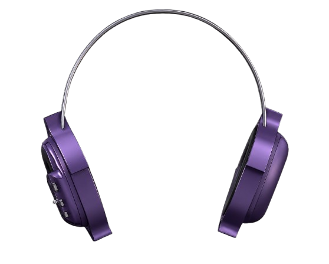

# 🎧 NovaBuds

### An end-to-end headphone concept combining industrial design, ergonomics, embedded electronics and custom PCB development.



---

## What if I could take a pair of headphones from a concept sketch all the way to the electronics?

NovaBuds started with that question.

What began as a headphone design exercise turned into an exploration of what happens when **industrial design and electrical engineering are developed together**.

I designed the headphone form and ergonomics, developed the earcup and headband in CAD, designed the electronics architecture, built the schematic in KiCad, created a custom-shaped PCB around the product geometry, planned the embedded system and designed the ambient display interface.

The goal was not just to make a headphone that looked interesting.

It was to understand what it takes to make the **product, electronics and interaction work as one system.**

---

# ✦ Project Snapshot

| | |
|---|---|
| **Project** | NovaBuds |
| **Type** | Headphone / Wearable Electronics |
| **Focus** | Industrial Design × Embedded Systems |
| **CAD** | Onshape |
| **PCB Design** | KiCad |
| **MCU** | ESP32-S3-WROOM |
| **Charging** | BQ24074 |
| **Regulation** | AP2112K 3.3 V |
| **Audio** | I²S + MAX98357A |
| **Sensing** | Hall-effect sensor |
| **Interface** | TFT ambient display + physical buttons |
| **PCB** | Custom-shaped |
| **Status** | Engineering prototype in development |

---

# 01 — The Idea

Most headphone projects begin with either the industrial design or the electronics.

I wanted to explore both at the same time.

The starting point was a wearable form that could accommodate:

- a custom earcup geometry
- a headband structure
- a local display
- physical controls
- a battery
- audio electronics
- a wireless MCU
- a custom PCB

That immediately created an interesting constraint:

> **The electronics couldn't simply be designed first and placed inside a box afterwards.**

The product geometry had to influence the electronics.

And the electronics had to influence the product geometry.

---

# 02 — Product Direction

NovaBuds is designed around three ideas:

### 01. Product form

A distinctive earcup geometry developed around the human-facing side of the product rather than around a conventional rectangular electronics package.

### 02. Ambient interaction

A small display provides glanceable information such as playback state, battery and connectivity without requiring the user to constantly reach for a phone.

### 03. Integrated engineering

The mechanical enclosure, PCB and interaction system are treated as parts of the same product rather than independent projects.

---

# 03 — From Sketch to CAD

The first iterations were developed through physical sketches and form exploration.


The form was then developed in Onshape into the final earcup and headband geometry.

### CAD development


The CAD work focused on:

- earcup geometry
- headband structure
- component packaging
- display placement
- button placement
- internal volume
- PCB integration
- enclosure transitions

The final assembly was developed as a complete headphone rather than as isolated parts.

---

# 04 — Ergonomics

Because the product is worn directly on the head, the geometry had to be considered from the user's perspective.

The main ergonomic considerations were:

- ear clearance
- contact surfaces
- enclosure thickness
- edge transitions
- button reach
- display visibility
- headband geometry
- internal component clearance

The controls were positioned on the earcup so that common interactions could be performed without relying entirely on a phone.

The display was treated as an **ambient information surface** rather than a miniature smartphone screen.

> The current geometry is a design exploration. Formal anthropometric studies and physical user testing are planned for future iterations.

---

# 05 — Electronics Architecture

The electronics were designed around an ESP32-S3 as the central controller.

```text
                         ┌────────────────────┐
                         │      ESP32-S3      │
                         │   MCU + Wireless   │
                         └─────────┬──────────┘
                                   │
              ┌────────────────────┼────────────────────┐
              │                    │                    │
              ▼                    ▼                    ▼
         TFT Display           Buttons             Hall Sensor
              │
              │
              └─────────────────────┐
                                    │
                                    ▼
ESP32-S3 ─────── I²S ───────► MAX98357A ───────► Speaker


USB-C ───────► BQ24074 ───────► Li-ion Battery
                    │
                    ▼
                 AP2112K
                    │
                   3V3
                    │
                    └──────► Digital Electronics
